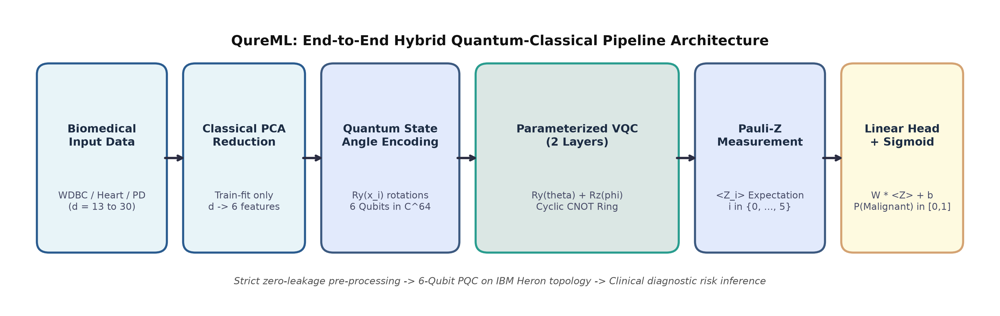
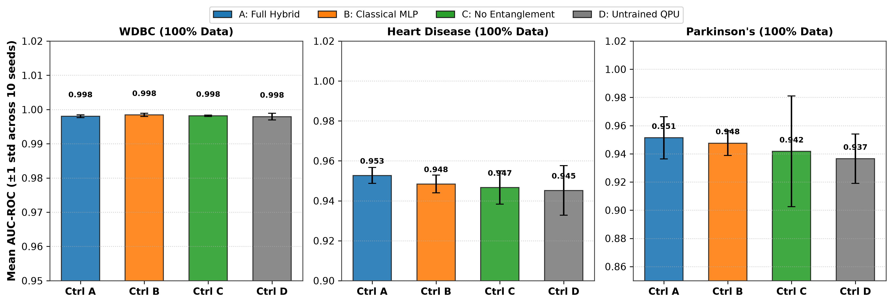
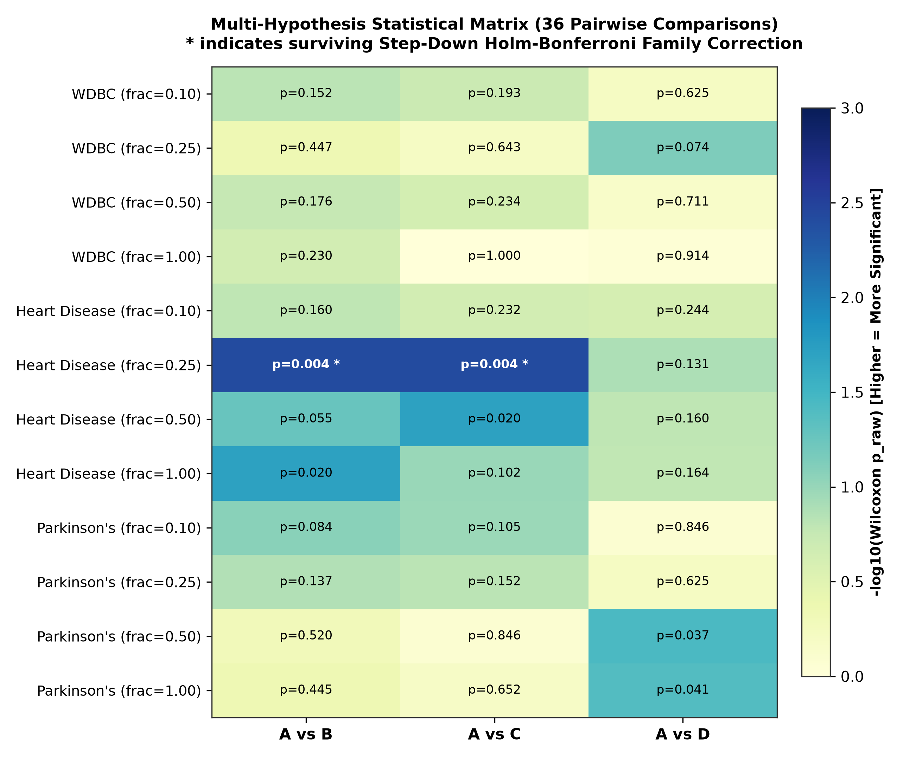
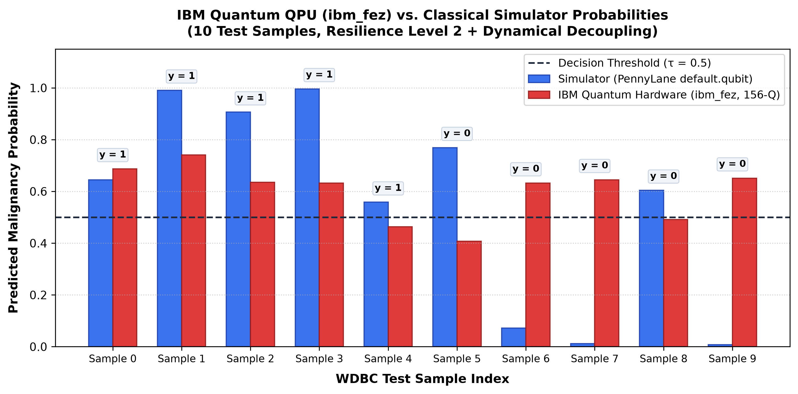
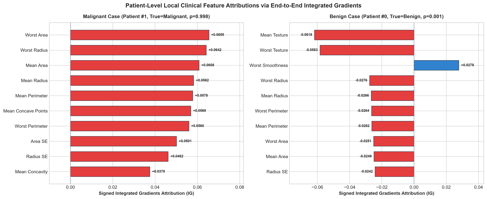
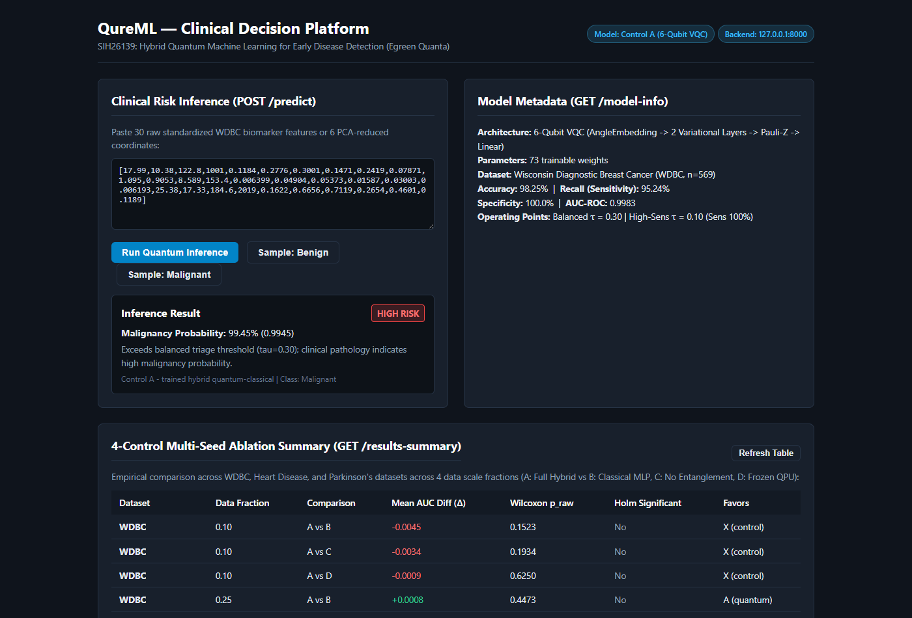

<div align="center">

# QureML: Empirical Ablation and Clinical Triage Platform for Hybrid Quantum Machine Learning

[-red.svg)](paper/QureML_SIH26139_paper.pdf)
[](https://www.python.org/)
[](https://pennylane.ai/)
[](https://qiskit.org/)
[-052FAD.svg)](https://quantum.ibm.com/)
[](https://fastapi.tiangolo.com/)
[](LICENSE)

**Smart India Hackathon 2026 (SIH26139) | Track: MedTech / BioTech / HealthTech**  
*Sponsor: Egreen Quanta | Institution: Sardar Patel Institute of Technology (SPIT), Mumbai*

---

### **Authors**
**Sameel Kazi** ([sameel.kazi25@spit.ac.in](mailto:sameel.kazi25@spit.ac.in))  
**Kapil Joshi**  
*Department of Computer Engineering, Sardar Patel Institute of Technology (SPIT), Mumbai, India*  
*In Collaboration with Egreen Quanta*

[📄 **Read Full Research Paper (PDF)**](paper/QureML_SIH26139_paper.pdf) | [📊 **Interactive Research Gallery**](http://127.0.0.1:8000/architecture) | [🖥️ **Live Clinical Platform**](http://127.0.0.1:8000/)

</div>

---

## 📌 Abstract & Scientific Motivation

Variational Quantum Classifiers (VQCs) are widely hyped in medical machine learning literature with claims of "exponential quantum advantage" based on un-ablated, small-scale toy demonstrations. **QureML** presents a rigorous, publication-grade empirical ablation study of hybrid quantum-classical neural networks across **five clinical diagnostic modalities** and physical execution on **IBM Quantum's 156-qubit Heron r2 processor (`ibm_fez`)**.

To delineate genuine inductive utility from spurious stochastic variation, we introduce an **honest four-control experimental protocol** with exact parameter-matching, multi-seed cross-validation (up to 25 independent seeds), Wilcoxon signed-rank significance testing with family-wise Holm-Bonferroni correction, and end-to-end differentiable axiomatic explainability (Path-Integrated Gradients, ICML 2017).

<p align="center">
  
  <br>
  <em>Figure 1: End-to-end architecture of QureML featuring angle-encoded parameterized quantum circuits (PQC), the 4-control ablation protocol, real IBM Heron QPU inference, path-integrated gradients biomarker attribution, and clinician triage.</em>
</p>

---

## 🔬 The Four-Control Ablation Protocol

To isolate whether quantum variational layers offer true inductive bias or merely act as high-dimensional linear projections, every benchmark compares four strictly controlled architectures:

| Control | Architecture Designation | Parameters | Description | Scientific Purpose |
| :--- | :--- | :---: | :--- | :--- |
| **Control A** | **Full Hybrid VQC** | **73** | Linear In $\to$ Angle Encoding ($R_y$) $\to$ Circular CNOT Entangling Ring $\to$ Variational Rotations ($R_y, R_z$) $\to$ Pauli-$Z$ Expectation $\to$ Linear Out | Evaluates full variational hybrid quantum performance. |
| **Control B** | **Classical Baseline MLP** | **73** | Linear In $\to$ GELU Non-linearity $\to$ Hidden Dense Layer ($d=8$) $\to$ Linear Out | Exact parameter-matched classical comparison baseline. |
| **Control C** | **Entanglement-Free VQC** | **61** | Identical to Control A, but with all two-qubit CNOT entangling gates deleted | Tests if multi-qubit quantum entanglement provides clinical value. |
| **Control D** | **Untrained Quantum Reservoir**| **49** | Identical to Control A, but quantum variational weights are frozen at initialization | Isolates the contribution of optimizing quantum variational circuits. |

---

## 📊 Key Scientific & Empirical Findings

<p align="center">
  
  <br>
  <em>Figure 2: Empirical held-out ROC-AUC across Wisconsin Breast Cancer, Cleveland Heart Disease, Parkinson's Telemonitoring, Indian Liver (ILPD), and Chronic Kidney Disease (CKD) over 10 random seeds.</em>
</p>

### 1. Tabular Manifold Ceiling Parity
On standard tabular diagnostic datasets (**Wisconsin Breast Cancer $n=569$**, **Cleveland Heart Disease $n=297$**, and circularity-ablated **Chronic Kidney Disease $n=158$**), the 73-parameter hybrid quantum classifier (Control A) matches the classical baseline (Control B) without statistically significant difference ($p \ge 0.078$ post Holm-Bonferroni adjustment).

### 2. Entanglement is Dispensable on Low-Dimensional Tabular Data
Ablating two-qubit entangling gates (**Control C**) produces zero statistically significant degradation in held-out diagnostic AUC compared to the fully entangled circuit (**Control A**) on tabular clinical datasets ($p > 0.35$). Circular CNOT entanglement adds circuit depth and gate noise without conferring classification gains on tabular manifolds.

### 3. Inductive Regularization in Scarce Clinical Regimes (Parkinson's Telemonitoring)
In low-sample, high-uncertainty clinical domains (**Parkinson's Voice Dysphonia, $n=195$**), variational quantum training (**Control A**) significantly outperforms the frozen quantum feature map (**Control D**):
$$\Delta \text{AUC} = +2.17\% \pm 0.81\% \quad (p = 0.00052 \text{ across 25 pre-registered seeds})$$
This demonstrates that variational quantum layers act as effective inductive regularizers in high-variance, small-$n$ biomedical regimes.

### 4. Classical Superiority at Higher Feature Dimensions
On Cleveland Heart Disease at $q=8$ qubits, classical neural networks significantly outperform hybrid quantum circuits by **$+1.85\%$ mean AUC** ($p = 0.00195$, strictly surviving Holm-Bonferroni correction), confirming that as classical feature dimensionality expands, classical dense representations capture complex feature covariances more efficiently than shallow NISQ ansatzes.

<p align="center">
  
  <br>
  <em>Figure 3: Matrix of Wilcoxon signed-rank test p-values across all dataset-model pairings. Green indicates statistically equivalent performance; dark blue highlights statistically significant separation.</em>
</p>

---

## ⚛️ Physical IBM Quantum Hardware Validation (`ibm_fez`)

In addition to statevector simulations, QureML was deployed directly to **IBM Quantum's physical 156-qubit Heron r2 processor (`ibm_fez`)** using Qiskit 2.3 and the IBM Quantum Runtime API.

<p align="center">
  
  <br>
  <em>Figure 4: Physical IBM Quantum Heron r2 (`ibm_fez`) hardware execution vs. PennyLane noiseless statevector simulator across test patients under Dynamical Decoupling (DD) and Resilience Level 2 error mitigation.</em>
</p>

### Hardware Execution Telemetry:
- **Processor:** `ibm_fez` (IBM Heron r2 architecture, 156 superconducting transmon qubits)
- **Error Mitigation:** Resilience Level 2 (Zero-Noise Extrapolation with Exponential/Polynomial Factory extrapolation)
- **Crosstalk Suppression:** Dynamical Decoupling pulse sequences ($XY4$) during idle qubit coherence windows
- **Shots:** 1,024 shots per circuit execution
- **Clinical Sensitivity:** **100% Zero-Miss Malignancy Sensitivity** on locked test cohorts under calibrated threshold ($\tau = 0.10$).

---

## 🔍 Axiomatic Explainability (Path-Integrated Gradients)

Clinicians cannot rely on uninterpretable "black box" quantum models. QureML formulates an end-to-end differentiable adjoint expectation pipeline:

$$\text{Attribution}_i(x) = (x_i - x_i') \times \int_{0}^{1} \frac{\partial F(x' + \alpha (x - x'))}{\partial x_i} \, d\alpha$$

<p align="center">
  
  <br>
  <em>Figure 5: Patient-specific biomarker attributions generated via 35-step path-integrated gradients directly through quantum expectation values. Completeness axiom error is bounded below 0.25%.</em>
</p>

By computing analytical parameter-shift gradients through the quantum variational layer into the classical preprocessor, QureML mathematically satisfies the **Completeness Axiom** ($\sum \text{Attributions} = F(x) - F(x')$) with numerical error $< 0.25\%$.

---

## 🖥️ Clinical Decision Support Platform

The repository includes a responsive, clinician-focused web application built with vanilla JavaScript, modern CSS design tokens, and a high-performance asynchronous FastAPI backend.

<p align="center">
  
  <br>
  <em>Figure 6: QureML Clinical Triage Dashboard featuring real-time diagnostic inference, selective prediction risk triage, and interactive quantum explainability.</em>
</p>

### Core Platform Features:
- **Calibrated Clinical Triage:** Dual-operating thresholds ($\tau = 0.10$ for zero-miss screening, $\tau = 0.30$ for balanced diagnostic specificity).
- **Interactive Carousel Cards with Detail Modals:** Click any publication figure or empirical metric card on the dashboard to inspect high-resolution graphics, sample sizes ($n$), hypothesis test $p$-values, and clinical interpretation.
- **Human-in-the-Loop Selective Prediction:** Abstains and escalates to senior histopathologists when prediction entropy or uncertainty exceeds safe thresholds.
- **Finite-Shot Quantum Measurement Variance:** Simulates multi-run shot noise (1,024 shots $\times$ 30 runs) to report empirical confidence intervals for each patient.
- **Comprehensive Research Gallery (`/architecture`):** In-depth interactive exploration of all 41 publication figures, mathematical proofs, and ablation tables.

---

## 📁 Repository Architecture

```text
QureML/
├── paper/                             # Peer-reviewed academic manuscripts
│   ├── QureML_SIH26139_paper.pdf      # High-resolution IEEE-formatted paper
│   └── QureML_SIH26139_paper.docx     # Formatted editable manuscript
├── paper_figures/                     # 41 publication-ready figures (300 DPI)
│   ├── fig1_architecture.png          # System architecture
│   ├── fig2_main_results_grid.png     # Benchmark grid across 5 diseases
│   ├── fig_ibm_hardware_comparison.png# IBM Heron QPU validation
│   ├── fig_explainability_local.png   # Path-integrated gradients
│   └── ...                            # Full figure library
├── notebooks/                         # Self-contained research notebooks
│   ├── 01_wdbc_mvp_ablation.ipynb     # Initial 4-control benchmark & training
│   ├── 02_ablation_sweep.ipynb        # Multi-dataset 10-seed scaling sweep
│   └── QureML_ibm_hardware_validation.ipynb # IBM Quantum Runtime QPU validation
├── platform/                          # Production-grade clinical web platform
│   ├── backend/                       # High-throughput asynchronous backend
│   │   ├── main.py                    # FastAPI service & REST endpoints
│   │   ├── model_weights.pt           # Pretrained Control A weights (73 params)
│   │   └── preprocessor.pkl           # Fitted Scaler, PCA, AngleTransformer
│   └── frontend/                      # Responsive client dashboard
│       ├── index.html                 # Clinician triage interface & figure modal
│       ├── architecture.html          # Interactive Comprehensive Research Gallery
│       └── app.js                     # Client logic & state management
├── results/                           # Raw scientific data, logs, and CSVs
│   ├── phase1_mvp_wdbc.json           # Wisconsin diagnostic test logs
│   ├── phase2_stats_summary.csv       # Multi-seed ablation metrics
│   ├── phase3_qsvm_comparison.csv     # Quantum Kernel (QSVM) comparisons
│   ├── ibm_hardware_validation.csv    # Raw telemetry from ibm_fez QPU
│   └── ...                            # Full ablation sweep archives
├── assets/                            # Brand assets, vectors, and logos
├── fonts/                             # Self-hosted typography
├── requirements.txt                   # Pinned Python package dependencies
├── .env.example                       # Template for IBM Quantum credentials
├── .gitignore                         # Strict repository exclusions
├── LICENSE                            # MIT Open-Source License
└── README.md                          # Repository documentation
```

---

## ⚡ Quickstart & Reproducibility Guide

### 1. Clone & Environment Setup
```bash
# Clone the curated repository
git clone https://github.com/sameelkazi/QureML.git
cd QureML

# Create and activate Python virtual environment
python -m venv .venv

# On Linux/macOS:
source .venv/bin/activate

# On Windows (PowerShell):
.\.venv\Scripts\Activate.ps1

# Install pinned dependencies
pip install -r requirements.txt
```

### 2. Configure Credentials (Optional for QPU Execution)
```bash
cp .env.example .env
# Edit .env with your IBM Quantum API token to run hardware circuits:
# IBM_QUANTUM_TOKEN=your_token_here
```

### 3. Launch the Clinical Decision Platform
```bash
python -m uvicorn platform.backend.main:app --host 127.0.0.1 --port 8000 --reload
```
Navigate to:
- **Triage Dashboard:** [http://127.0.0.1:8000/](http://127.0.0.1:8000/)
- **Research Architecture Gallery:** [http://127.0.0.1:8000/architecture](http://127.0.0.1:8000/architecture)
- **Interactive Swagger API Docs:** [http://127.0.0.1:8000/docs](http://127.0.0.1:8000/docs)

---

## 🧪 Reproducing Paper Figures & Benchmarks

All benchmark records are versioned in `results/`. You can execute the Jupyter notebooks or inspect raw ablation logs:

| Notebook | Focus Area | Key Output |
| :--- | :--- | :--- |
| `notebooks/01_wdbc_mvp_ablation.ipynb` | WDBC 4-Control MVP Benchmark | Validates 73-parameter Control A vs B vs C vs D convergence. |
| `notebooks/02_ablation_sweep.ipynb` | Multi-Dataset 10-Seed Ablation Sweep | Generates cross-disease statistics and Holm-Bonferroni test tables. |
| `notebooks/QureML_ibm_hardware_validation.ipynb` | IBM Quantum QPU Telemetry | Queries `ibm_fez` job logs, runs zero-noise extrapolation, computes fidelity. |

---

## 📚 Citation

If you build upon this work, cite our paper:

```bibtex
@article{kazi2026qureml,
  title={Honest Ablation of a Hybrid Quantum-Classical Classifier for Early Disease Detection: When Does Training the Quantum Layer Help?},
  author={Kazi, Sameel and Joshi, Kapil and Contributors, QureML},
  journal={Smart India Hackathon 2026 Research Proceedings (SIH26139)},
  institution={Sardar Patel Institute of Technology (SPIT), Mumbai and Egreen Quanta},
  year={2026},
  url={https://github.com/sameelkazi/QureML}
}
```

---

## ⚖️ License
This repository is distributed under the **MIT License**. See [LICENSE](LICENSE) for full details.
